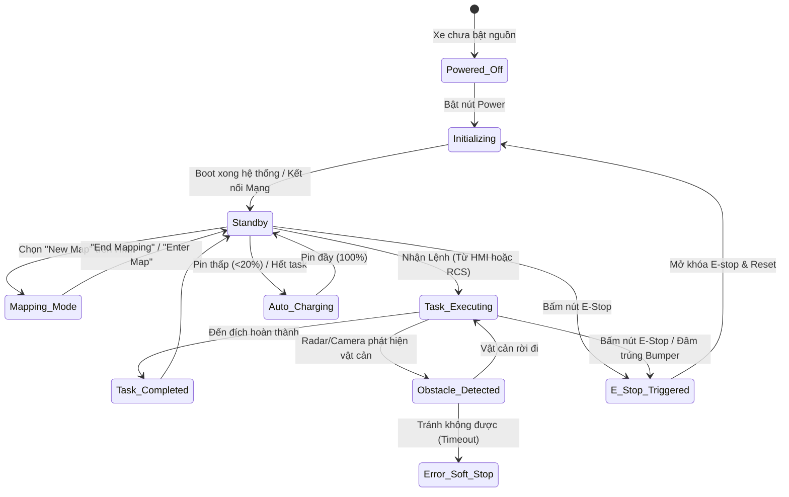
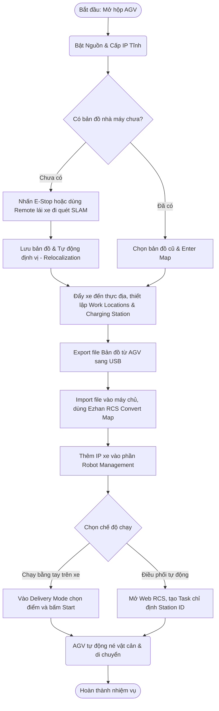
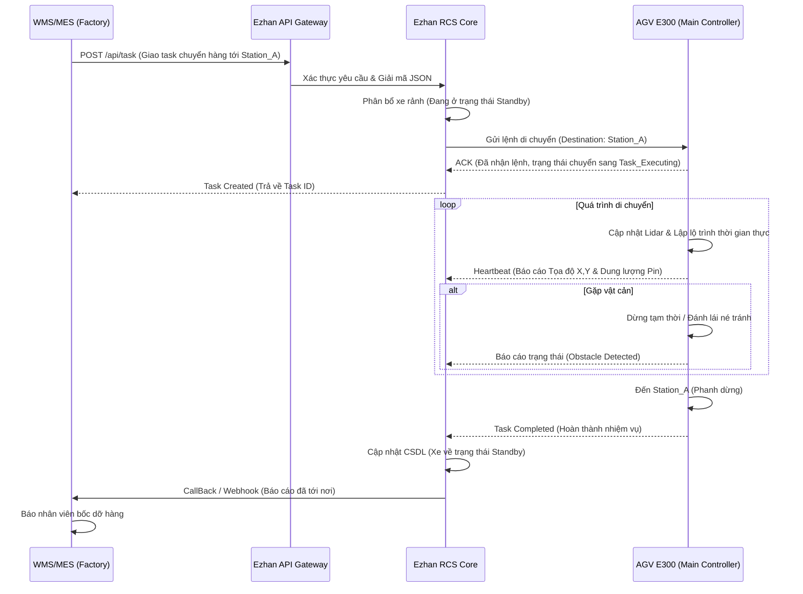

# Bộ Sơ Đồ Phân Tích Hệ Thống Xe Tự Hành AGV E300 & Ezhan RCS

Tài liệu này cung cấp cái nhìn chuyên sâu về kiến trúc kết nối, luồng trạng thái, quy trình vận hành và điều khiển tín hiệu của toàn bộ hệ thống Robot AGV E300.

---

## 1. Sơ Đồ Kiến Trúc Hệ Thống (System Architecture & Connection Diagram)
Sơ đồ này mô tả cách phần cứng trên xe AGV giao tiếp với máy chủ trung tâm Ezhan RCS và hệ thống phần mềm của nhà máy (WMS/ERP).

```mermaid
graph TD
    %% Định nghĩa Node %%
    subgraph AGV["Phần Cứng Xe Tự Hành (AGV E300)"]
        HMI["Màn hình cảm ứng HMI"]
        MainCtrl["Bộ điều khiển chính (Host Computer)"]
        Motor["Động cơ / Bánh xe (Drive Wheels)"]
        Brake["Phanh điện từ & Cảm biến va chạm (Bumper)"]
        Lidar["Cảm biến Laser Lidar (SLAM)"]
        Cam3D["Camera 3D (Tránh vật cản)"]
        Battery["Pin Lithium & Mạch quản lý BMS"]
        
        Lidar -->|Dữ liệu đám mây điểm| MainCtrl
        Cam3D -->|Hình ảnh chiều sâu| MainCtrl
        MainCtrl -->|Tín hiệu điều khiển| Motor
        Brake -.->|Ngắt động cơ khi va chạm| Motor
        Battery -->|Cấp nguồn| MainCtrl
        HMI <-->|Giao diện điều khiển| MainCtrl
    end

    subgraph Network["Hạ tầng Mạng (Network)"]
        WiFi["Router Wi-Fi Công Nghiệp"]
        Switch["Network Switch"]
    end

    subgraph Server["Máy Chủ Trung Tâm (Ezhan RCS)"]
        RCS_Core["Ezhan Core Service (Port 8080)"]
        DB["Cơ sở dữ liệu (Map, Task, Robot logs)"]
        UI["Web Dashboard"]
        
        RCS_Core <--> DB
        RCS_Core <--> UI
    end

    subgraph Factory["Hệ Thống Nhà Máy (3rd Party)"]
        WMS["Hệ thống QL Kho (WMS)"]
        MES["Hệ thống Điều hành SX (MES)"]
        API_GW["API Gateway (REST HTTP/JSON)"]
    end

    %% Kết nối luồng dữ liệu %%
    MainCtrl <-->|Giao thức TCP/UDP (IP Tĩnh)| WiFi
    WiFi <--> Switch
    Switch <-->|Cáp LAN| RCS_Core

    RCS_Core <-->|Gọi API| API_GW
    API_GW <--> WMS
    API_GW <--> MES
```

---

## 2. Sơ Đồ Trạng Thái Của AGV (AGV State Machine Diagram)
Mô tả các trạng thái sinh mệnh của AGV từ lúc bật máy đến khi sạc pin hoặc gặp lỗi.



---

## 3. Sơ Đồ Luồng Vận Hành (Operational Flowchart)
Quy trình thao tác logic (Standard Operating Procedure) từ lúc bóc hộp đến lúc xe chạy thực tế.



---

## 4. Sơ Đồ Điều Khiển Tín Hiệu (Control Sequence Diagram)
Mô phỏng quá trình giao tiếp (Ping-Pong) khi Hệ thống WMS của nhà máy gọi lệnh thông qua RCS để điều AGV đi lấy hàng.


