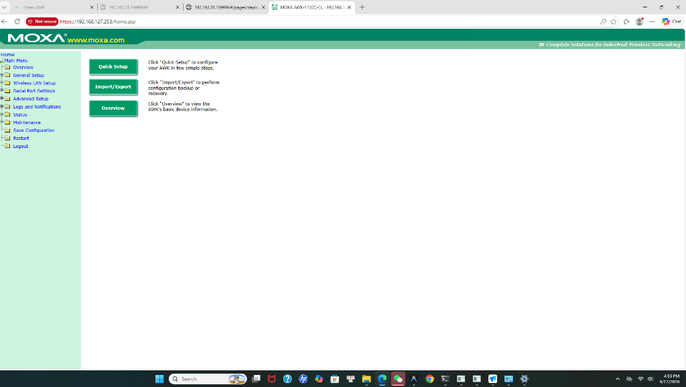
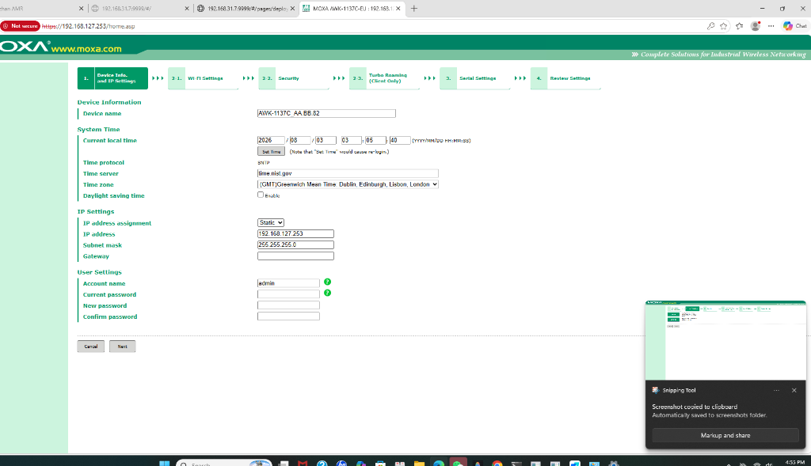
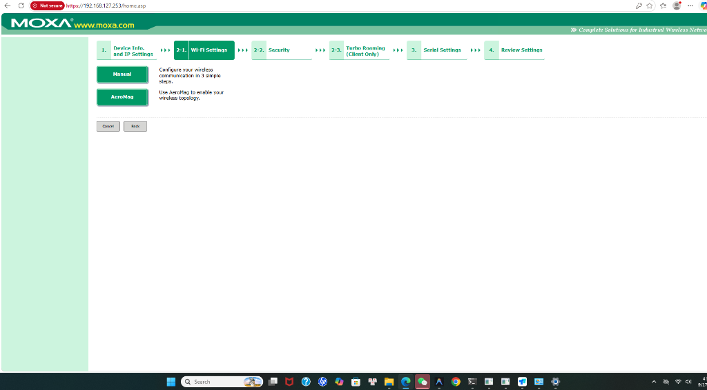
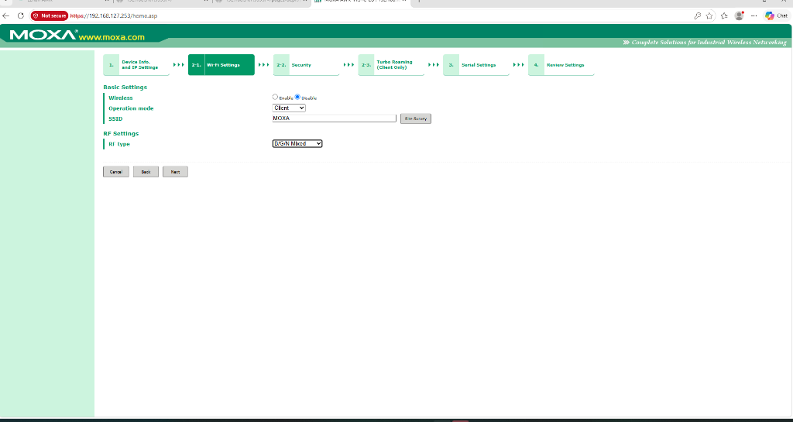
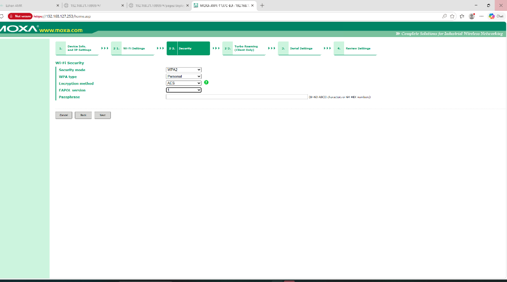
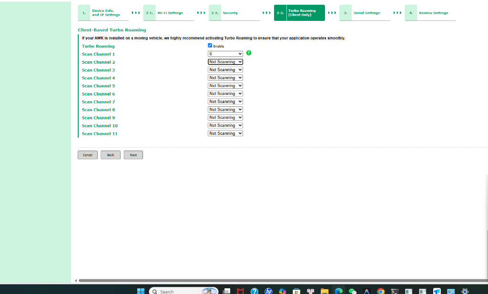
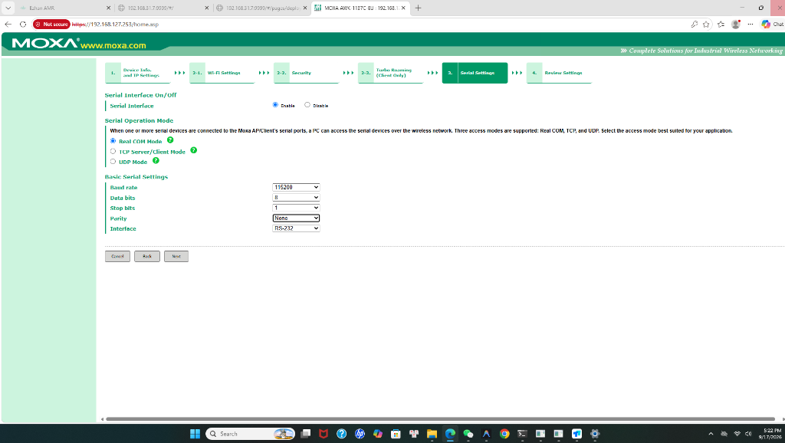
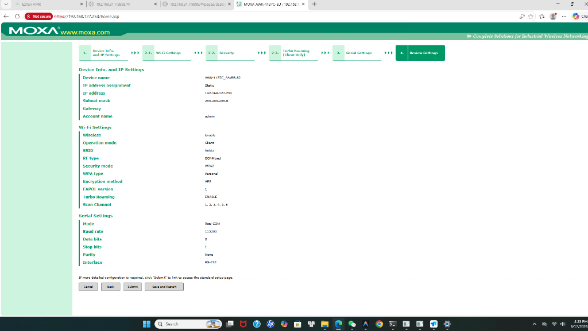

# TÀI LIỆU HƯỚNG DẪN KẾT NỐI, TẠO BẢN ĐỒ VÀ VẬN HÀNH TOÀN DIỆN ROBOT AGV E300 SERIES

> **Quy trình Kỹ thuật Chuẩn về Khởi động, Cấu hình Mạng, Quét SLAM Bản đồ, Thiết lập Trạm sạc Tự động, Cơ chế Nâng hạ Kệ hàng (Jacking), Kết nối Hộp gọi Callbox và Hệ thống Điều phối Ezhan RCS V2.**  
> **Dòng thiết bị:** AMR / AGV E300 Series (Dòng BZ Tiêu chuẩn & GT Kích nâng)  
> **Công nghệ điều hướng:** Laser SLAM Navigation 2D/3D + Camera 3D  
> **Phần mềm điều phối:** Ezhan RCS Dispatching System V2 (2026)  
> **Đơn vị phát triển & biên soạn:** ESATECH Automation Systems © 2026

---

## 🚀 CHEAT SHEET: 6 BƯỚC KHỞI TẠO NHANH ĐỂ XE TỰ CHẠY TỪ CON SỐ 0

Dưới đây là tóm tắt quy trình thực hành nhanh nhất cho kỹ thuật viên:

```text
[BƯỚC 1: CẤP MẠNG IP TĨNH] ──> [BƯỚC 2: QUÉT MAP SLAM] ──> [BƯỚC 3: CÀI ĐIỂM DỪNG / SẠC / KỆ]
            │                                                                  │
            ▼                                                                  ▼
[BƯỚC 6: GIAO LỆNH VẬN HÀNH] <── [BƯỚC 5: KẾT NỐI HỘP GỌI] <── [BƯỚC 4: ĐỒNG BỘ LÊN RCS V2]
```

* **BƯỚC 1 - Bật nguồn & Đặt IP tĩnh:** Nhấn nút Power trên xe, chờ màn hình HMI sáng. Vào `System Settings ➔ Network Settings` kết nối Wi-Fi nhà máy và gán **IP tĩnh cố định** (Ví dụ: `192.168.1.61`).
* **BƯỚC 2 - Quét Bản đồ SLAM:** Vào `Map Settings ➔ New Map` đặt tên map (VD: `Esa_1`). Lái xe đi quét map bằng **Cần gạt ảo `Remote Ctrl` trên màn hình xe**, hoặc dùng **Remote**, hoặc **cắm Chuột USB vào xe**. Quét xong bấm `Save Map ➔ End Mapping ➔ Enter Map` để xe tự động chốt định vị.
* **BƯỚC 3 - Cài đặt Điểm dừng, Trạm sạc & Kệ:**
  * *Điểm làm việc:* Đưa xe đến vị trí ➔ Vào `Work Locations ➔ Add location ➔ Update ➔ Upload location`.
  * *Trạm sạc:* Đẩy đuôi xe cách chấu sạc 2-5cm ➔ Vào `Special Locations` lưu tọa độ làm điểm sạc (`Charge`).
  * *Kệ hàng (nếu có nâng hạ):* Vào `Shelf Settings` đo và nhập đúng kích thước 4 chân kệ ➔ Bấm `Used`.
* **BƯỚC 4 - Đồng bộ Map lên RCS V2:** Mở Web RCS (`http://127.0.0.1`) ➔ Vào `Quản lý bản đồ` thêm map `Esa_1` và bấm `Đồng bộ bản đồ` ➔ Vào `Quản lý thiết bị` thêm xe `AMR003` với IP tĩnh `192.168.1.61`.
* **BƯỚC 5 - Cấu hình Hộp gọi Callbox:** Bắt Wi-Fi do Hộp gọi phát ra (`callbox...-SETUP`) ➔ Mở trình duyệt vào `http://192.168.4.1/` cài Wi-Fi nhà máy & IP Server ➔ Sau khi kết nối thành công, **nhìn màn hình OLED lấy địa chỉ IP nhận được** (dòng `IP: ...`) ➔ Vào Web RCS (`http://127.0.0.1/device/callbox`) dán IP này vào ô `ICCID/IP` để gán nút điều khiển (K1: Giao hàng, K2: Nâng kệ, K3: Về sạc).
* **BƯỚC 6 - Vận hành thử nghiệm:** Bấm nút trên Hộp gọi hoặc bấm trên Web/màn hình xe ➔ Xe tự động chạy giao hàng, tự nâng kệ và tự lùi về trạm sạc khi hết pin!

---

## 📑 MỤC LỤC CHI TIẾT TÀI LIỆU

* [Phần 1: Tổng quan Thiết bị & Quy tắc An toàn Vận hành](#phần-1-tổng-quan-thiết-bị--quy-tắc-an-toàn-vận-hành)
* [Phần 2: Khởi động Thiết bị & Cấu hình Mạng IP Tĩnh Cố định](#phần-2-khởi-động-thiết-bị--cấu-hình-mạng-ip-tĩnh-cố-định)
* [Phần 3: Kết nối Hệ thống Điều phối Trung tâm Ezhan RCS V2](#phần-3-kết-nối-hệ-thống-điều-phối-trung-tâm-ezhan-rcs-v2)
* [Phần 4: Quy trình Quét SLAM & Tạo Bản đồ Mới (4 Phương pháp)](#phần-4-quy-trình-quét-slam--tạo-bản-đồ-mới)
* [Phần 5: Thiết lập Điểm Làm việc, Vùng An toàn & Tường ảo](#phần-5-thiết-lập-điểm-làm-việc-vùng-an-toàn--tường-ảo)
* [Phần 6: Cấu hình Cơ chế Sạc Tự động (Auto-Charging) Chuẩn xác](#phần-6-cấu-hình-cơ-chế-sạc-tự-động-auto-charging-chuẩn-xác)
* [Phần 7: Cơ chế Nhận diện & Nâng/Hạ Kệ Hàng (Lift / Jacking Mode)](#phần-7-cơ-chế-nhận-diện--nânghạ-kệ-hàng-lift--jacking-mode)
* [Phần 8: Cấu hình Hộp gọi Không dây Callbox Điều khiển Robot](#phần-8-cấu-hình-hộp-gọi-không-dây-callbox-điều-khiển-robot)
* [Phần 9: Đồng bộ Bản đồ & Điều phối Đa xe từ xa qua RCS](#phần-9-đồng-bộ-bản-đồ--điều-phối-đa-xe-từ-xa-qua-rcs)
* [Phần 10: Sổ tay Xử lý Sự cố Nhanh & Bảo trì Định kỳ](#phần-10-sổ-tay-xử-lý-sự-cố-nhanh--bảo-trì-định-kỳ)

---

## PHẦN 1: TỔNG QUAN THIẾT BỊ & QUY TẮC AN TOÀN VẬN HÀNH

### 1.1. Cấu tạo Phần cứng Cốt lõi của Robot E300
* **Hệ thống dẫn động vi sai 2 bánh (Double Wheel Differential Drive):** Cho phép robot xoay tròn 360° tại chỗ với bán kính quay bằng 0 (đường kính quay chỉ `840 mm`).
* **Cảm biến Laser Lidar (ở đầu trước xe):** Đặt ở độ cao `180 mm`, góc quét rộng `240°`, tầm quét phát hiện vật thể tối đa `25 mét`.
* **Cảm biến Camera 3D (trên trụ xe):** Nhận diện độ sâu 3D, phát hiện vật cản thấp sát mặt sàn (dưới 15cm) và chướng ngại vật treo trên cao.
* **Thanh cản va chạm cơ khí (Safety Bumper):** Bo quanh chân xe, kích hoạt ngắt phanh khẩn cấp cấp độ 2 khi chạm vật cản sát sườn.
* **Mâm kích nâng (Jacking Platform - Tùy chọn dòng GT):** Hành trình nâng tối đa **`55 mm (± 2mm)`**, tải trọng nâng tối đa **`300 kg`**. Chiều cao mặt bàn khi hạ là `210 mm`, khi nâng đạt `265 mm` cách mặt đất.
* **Chấu tiếp xúc sạc tự động (Charging Contact):** 2 bản cực đồng mạ vàng ở phía sau đuôi xe bên phải, dùng để kết nối với trạm sạc `E-YLH-10A`.
* **Hệ thống nút Dừng khẩn cấp (E-Stop):** Gồm 1 nút xoay trên trụ màn hình (Pole-mounted E-Stop) và 1 nút ở hông dưới chân xe (Bottom Side E-Stop).

### 1.2. Quy tắc An toàn Mặt sàn & Điểm mù Cảm biến
* **Yêu cầu mặt sàn:** Bằng phẳng, độ dốc ≤ 5°, gờ nổi ≤ 5mm, khe rãnh ≤ 20mm, hệ số ma sát tĩnh ≥ 1.0.
* **TUYỆT ĐỐI KHÔNG ĐÁNH BÓNG SÀN (WAXING):** Sàn dính sáp/dầu mỡ làm bánh xe bị trượt, dẫn đến trôi tọa độ và mất định vị SLAM.
* **Điểm mù quang học:** Mắt Lidar và Camera 3D nằm ở ĐẦU XE. **Hai bên sườn phía sau và đuôi xe là ĐIỂM MÙ.** Do đó, theo tiêu chuẩn quốc tế ISO 3691-4, xe không chạy lùi tự do ở tốc độ cao mà chỉ lùi có kiểm soát chậm (<0.1 m/s) khi lùi vào sạc hoặc lùi rút gầm kệ.

---

## PHẦN 2: KHỞI ĐỘNG THIẾT BỊ & CẤU HÌNH MẠNG IP TĨNH CỐ ĐỊNH

### 2.1. Quy trình Khởi động Xe
1. Nhấn giữ **Nút Nguồn (Power Button)** trên trụ xe 3 giây cho đến khi dải đèn LED phát sáng và màn hình HMI bật lên.
2. Kiểm tra các nút E-Stop: Xoay nhả theo chiều kim đồng hồ để đảm bảo nút E-Stop không bị nhấn kẹt.
3. Chờ màn hình tải hoàn tất giao diện ứng dụng **Ezhan AMR**.

### 2.2. Quy Tắc Thiết Lập Mạng IP Tĩnh (Static IP) & Bộ Phát Wi-Fi Riêng

> [!IMPORTANT]
> **LƯU Ý CỐT LÕI VỀ ĐỊA CHỈ IP KHI TRIỂN KHAI THỰC TẾ TẠI NHÀ MÁY:**  
> Toàn bộ các địa chỉ IP được nêu trong tài liệu này (như `192.168.1.61`, `192.168.1.100`, `192.168.1.35`...) **HOÀN TOÀN CHỈ LÀ VÍ DỤ THAM KHẢO MINH HỌA**.  
> Khi đến nhà máy lắp đặt thực tế, đội ngũ kỹ thuật sẽ **sử dụng 01 Bộ phát Wi-Fi chuyên dụng riêng** (hoặc dải mạng riêng do IT nhà máy cấp phát).
>
> **Nguyên tắc kỹ thuật bắt buộc phải tuân thủ:**
> 1. **Cùng chung Dải mạng (Subnet):** Cả 3 thiết bị gồm **Máy tính Server điều phối RCS, Robot AGV E300 và Hộp gọi Callbox** bắt buộc phải kết nối vào **cùng một Bộ phát Wi-Fi** (chung dải mạng, ví dụ dải `192.168.68.x`, `192.168.0.x`, `10.10.x.x`...).
> 2. **Phải đặt IP Tĩnh (Static IP):** Không được để chế độ cấp phát động DHCP tự đổi IP mỗi ngày. Phải đặt IP tĩnh cố định cho từng thiết bị theo dải IP của bộ phát Wi-Fi đó.

* **Ví dụ mẫu thiết lập IP tĩnh trên màn hình HMI của Robot:**
  1. Vào màn hình chính ➔ Chọn **System Settings ➔ Network Settings**.
  2. Kết nối vào SSID của **Bộ phát Wi-Fi riêng** mang theo (ưu tiên băng tần 5GHz hoặc 2.4GHz công nghiệp).
  3. Chuyển từ chế độ `DHCP` sang **`Static IP`**:
     * **IP Address:** `192.168.1.61` *(Ví dụ minh họa - Trên thực tế sẽ đặt theo dải IP của Bộ phát Wi-Fi, ví dụ `192.168.68.61`)*
     * **Gateway:** `192.168.1.1` *(Địa chỉ IP của chính Bộ phát Wi-Fi)*
     * **Netmask:** `255.255.255.0`
     * **DNS:** `8.8.8.8` hoặc `1.1.1.1`
  4. Bấm **Save (Lưu)** và ghi chép lại địa chỉ IP này để nhập vào phần mềm điều phối RCS.

---

## PHẦN 3: KẾT NỐI HỆ THỐNG ĐIỀU PHỐI TRUNG TÂM EZHAN RCS V2

Phiên bản **Robot Central Dispatch System Project2 (V2)** mang lại độ ổn định cao, hỗ trợ đa bản đồ và điều phối linh hoạt.

### 3.1. Cấu hình Cổng Mạng & Cơ sở dữ liệu
* **Web Nginx Dashboard:** Chạy tại cổng **`80`** (hoặc `8080`), truy cập qua trình duyệt: `http://127.0.0.1/` (hoặc `http://localhost:8080/`).
* **Backend Java Service (`Ezhan.jar`):** Chạy trên nền tảng **JDK 17**, lắng nghe API tại cổng **`8080`**.
* **Cơ sở dữ liệu MariaDB:** Cổng `3306`, Database: `Ezhan` (Tài khoản: `root` / Mật khẩu: `123456`).
* **License Key:** File [`config/license.key`](file:///C:/Users/Admin/Downloads/EZHAN/EZHAN/Robot%20Central%20Dispatch%20System%20Project2/config/license.key) chứa mã bản quyền được kích hoạt cố định theo địa chỉ MAC máy chủ của bạn.

### 3.2. Khởi chạy Hệ thống Bằng 1 Click (`start.bat`)
Chạy file [`start.bat`](file:///C:/Users/Admin/Downloads/EZHAN/EZHAN/Robot%20Central%20Dispatch%20System%20Project2/start.bat). Script sẽ tự động:
1. Chạy cập nhật cấu trúc cơ sở dữ liệu `update_schema.sql` (bổ sung các bảng `amr_charging_pile`, `amr_station_point`, `amr_elevator`, `amr_restrict_zone`).
2. Khởi động Redis Service và Nginx Web Server.
3. Chạy `Ezhan.jar` bằng môi trường Java di động `jdk-17`.
4. Mở trình duyệt đăng nhập: Tài khoản mặc định `admin` / Mật khẩu `admin123`.

---

## PHẦN 4: QUY TRÌNH QUÉT SLAM & TẠO BẢN ĐỒ MỚI

Tạo bản đồ SLAM là bước quan trọng nhất để Robot hiểu không gian xưởng.

```text
[1. Tạo New Map] ──> [2. Lái xe quét quanh xưởng] ──> [3. Save Map] ──> [4. Enter Map chốt định vị]
```

### 4.1. Khởi tạo Bản đồ trên HMI
1. Trên màn hình xe, vào: **System Settings ➔ Map Settings**.
2. Bấm nút **`New Map`** ➔ Nhập tên bản đồ gợi nhớ (Ví dụ: **`Esa_1`** - *Lưu ý viết đúng tên này để đồng bộ lên Web*).
3. Bấm **`Confirm`**.

### 4.2. Bốn Phương Pháp Lái Xe Quét Bản Đồ (Lựa chọn tùy điều kiện)

#### 👉 PHƯƠNG PHÁP 1: DÙNG CẦN GẠT ẢO TRÊN MÀN HÌNH XE (`Remote Ctrl` - Tiện nhất, không cần mua remote)
1. Trên màn hình Map Settings: Nhìn lên góc trên bên phải, gạt nút **`Remote Ctrl`** sang **BẬT (ON)**.
2. Một **Vòng tròn Joystick ảo màu xanh dương** sẽ xuất hiện trên màn hình.
3. Chạm ngón tay vào chấm tròn màu xanh và kéo rê theo hướng muốn xe đi:
   * Kéo lên: Xe tiến thẳng.
   * Kéo trái / phải: Xe xoay hướng.
   * Nhấc tay ra: Xe dừng lại an toàn.
4. Lái xe đi một vòng khép kín quanh xưởng để Lidar quét các mép tường.

#### 👉 PHƯƠNG PHÁP 2: DÙNG TAY CẦM KHÔNG DÂY (REMOTE JOYSTICK)
1. Nhấn nút trắng (**Wake-up Button**) trên tay cầm điều khiển. Đèn LED chuyển sang màu xanh lá sáng ổn định báo hiệu đã kết nối.
2. Dùng cần Joystick trên tay cầm nhẹ nhàng lái xe di chuyển quanh nhà xưởng với tốc độ chậm `0.3 - 0.5 m/s`.
3. *Ưu điểm:* Không cần nhấn nút E-Stop, xe tự động mở phanh lái bằng động cơ mượt mà.

#### 👉 PHƯƠNG PHÁP 3: CẮM CHUỘT / BÀN PHÍM KHÔNG DÂY VÀO CỔNG USB CỦA XE
1. Lấy đầu thu USB của Chuột không dây cắm vào cổng USB ở cạnh dưới hoặc bên hông màn hình xe.
2. Màn hình xe lập tức hiện con trỏ chuột máy tính.
3. Bật `Remote Ctrl` lên, bạn cầm chuột không dây đi sau xe nhấn giữ kéo cần Joystick ảo cực kỳ nhẹ nhàng, không lo giật lag!

#### 👉 PHƯƠNG PHÁP 4: ĐẨY TAY THỦ CÔNG (MANUAL PUSH WITH E-STOP)
1. Nhấn nút E-Stop ở hông xe xuống (Side E-Stop) để giải phóng phanh điện từ của bánh xe.
2. Dùng 2 tay đẩy từ từ xe di chuyển khắp các hành lang cần lập bản đồ.

### 4.3. Lưu Bản Đồ & Kích Hoạt Tự Động Định Vị (Relocalization)
1. Khi đã quét giáp một vòng xưởng về lại điểm xuất phát, bấm **`Save Map` (Lưu bản vẽ)**.
2. Bấm **`End Mapping` (Kết thúc quét)**.
3. Hộp thoại xác nhận hiện ra, bấm **`Enter Map` (Vào bản đồ)**.
4. Xe sẽ quét Lidar thời gian thực so khớp với bản đồ vừa lưu để chốt tọa độ. Khi dòng **`Position Confidence > 70%`** là bản đồ đã sẵn sàng hoạt động!

---

## PHẦN 5: THIẾT LẬP ĐIỂM LÀM VIỆC, VÙNG AN TOÀN & TƯỜNG ẢO

### 5.1. Thiết lập Điểm Làm việc Tiêu chuẩn (Work Locations)
1. Lái xe đến vị trí thực tế trên sàn (ví dụ trạm máy CNC hoặc kho nguyên liệu).
2. Vào menu: **Location ➔ Work Locations**:
   * Với map mới, bấm `Location from map` để đồng bộ.
   * Bấm **`Add location`** ➔ Đặt tên điểm (Ví dụ: `Esa_1_ahuy`, `Esa_1_acong`).
   * Bấm **`Update`** ➔ Sau khi thêm đủ các điểm, bấm **`Upload location`** để lưu cố định.

### 5.2. Vẽ Tường Ảo (Virtual Wall) - Ngăn Xe Chui Vào Khe Hẹp & Ngõ Cụt
Tường ảo giúp ngăn chặn triệt để tình huống xe né vật cản rồi chui vào ngách hẹp kẹt bánh:
1. Vào **System Settings ➔ Map Settings ➔ Chọn bản đồ `Esa_1`**.
2. Chọn công cụ **`Draw Area` ➔ Chọn `Virtual Wall` (Tường ảo)**.
3. Dùng tay chạm lên màn hình vẽ các vạch đỏ/vùng đỏ bịt kín các khoảng trống giữa các chân máy móc, ngõ cụt và khu vực nguy hiểm.
4. Bấm **`Save Drawing` ➔ `End Drawing`**. Xe sẽ coi đây là tường bê tông và tuyệt đối không bao giờ lách vào đó!

---

## PHẦN 6: CẤU HÌNH CƠ CHẾ SẠC TỰ ĐỘNG (AUTO-CHARGING) CHUẨN XÁC

Xe E300 sử dụng cơ chế lùi chấu tiếp xúc ở đuôi xe vào trạm sạc `E-YLH-10A` (54.75V / 10A).

```text
               ┌───────────────────────────────┐
               │    TRẠM SẠC ĐẶT SÁT TƯỜNG     │
               └──────────────┬────────────────┘
                              │
                    📍 ĐIỂM SẠC CHÍNH (Charge - Type 10)
                              ▲
                              │ Lùi thẳng chậm 0.8m (< 0.1 m/s)
                              │
               📍 ĐIỂM TIỀN TRẠM SẠC (Pre-charging - Type 11)
                     (Mũi tên hướng thẳng vào trạm sạc)
                              ▲
                              │ Xe chạy tiến tới đây rồi xoay 180° quay đuôi lại
                       [ROBOT E300]
```

### 6.1. Quy trình Lấy Tọa độ Điểm Sạc Chuẩn (Trang 44 User Manual)
1. Nhấn nút E-Stop, dùng tay đẩy lùi đuôi xe vào sát trạm sạc sao cho 2 bản cực đồng ở đuôi xe áp sát chấu trạm sạc (cách **`2 - 5 cm`**).
2. Xoay nhả E-Stop ➔ Vào **Location ➔ Special Locations ➔ Bấm `Update` tại dòng `Charge`**.
3. Ra màn hình chính bấm **`Return to charge`** để xe tự lùi cắm sạc vào trạm.
4. Khi màn hình hiện biểu tượng **Tia sét (Đang sạc)** ➔ Vào lại `Special Locations` bấm **`Update`** lần 2 để chốt tọa độ tiếp xúc tuyệt đối 100%.

### 6.2. Thiết lập Điểm Tiền Trạm Sạc (Pre-charging Point)
* Đặt 1 điểm dừng thẳng phía trước trạm sạc cách chấu sạc **`0.8m - 1.0m`** với mũi tên hướng thẳng vào trạm sạc.
* *Tác dụng:* Xe chạy tiến đến điểm này trước ➔ Xoay 180 độ quay đuôi xe lại ➔ Lùi thẳng tắp vào chấu sạc êm ái mà không bị lệch góc.

### 6.3. Bật Tự Động Về Sạc Khi Pin Yếu & Khi Rảnh Rỗi
* Vào **System Settings ➔ Basic Settings**:
  * Gạt **`Autonomous Charging = ON`** (Bật sạc tự động).
  * Ô **`Automatic Charging Threshold`**: Đặt là **`20%`** (khi pin dưới 20%, xe tự hủy task chờ và quay về sạc).
  * Bấm **`Save settings`**.

---

## PHẦN 7: CƠ CHẾ NHẬN DIỆN & NÂNG/HẠ KỆ HÀNG (LIFT / JACKING MODE)

Áp dụng cho dòng xe có cơ cấu mâm nâng kích điện/thủy lực chịu tải 300kg.

### 7.1. Kích thước Bàn nâng Chuẩn
* **Khi bàn nâng HẠ thấp nhất:** Mặt bàn cách mặt đất **`210 mm (21 cm)`**. Gầm giá kệ trong xưởng phải cao tối thiểu **`240 mm - 250 mm`** để xe chui lọt dễ dàng.
* **Hành trình nâng:** Kích đẩy lên cao **`55 mm (± 2mm)`**.
* **Khi bàn nâng NÂNG cao nhất:** Mặt bàn đạt độ cao **`265 mm`**, nhấc bổng 4 chân kệ cách mặt sàn **`1.5 cm - 2.5 cm`** để vận chuyển.

### 7.2. Cấu hình Kích thước Kệ Hàng Thực tế (`Shelf Settings` - Trang 72-75 User Manual)
Vào **System Settings ➔ Shelf**: Bấm `Add Shelf` (hoặc sửa `shelf_1`), dùng thước dây đo thực tế và nhập thông số:
* **`Shelf Width` / `Length`:** Chiều rộng và chiều dài mặt kệ (Ví dụ: `0.650 m` và `0.550 m`).
* **`Leg Center Distance (Width)`:** Khoảng cách đo từ tâm chân trái sang tâm chân phải (Ví dụ: `0.580 m`).
* **`Leg Center Distance (Length)`:** Khoảng cách đo từ tâm chân trước sang tâm chân sau (Ví dụ: `0.450 m`).
* **`Actual Leg Width`:** Độ dày thanh sắt chân kệ (Ví dụ: `0.040 m = 4cm`).
* **`Insertion Depth`:** Đặt **`-0.400 m`** (đối với kệ dài 0.5m - 0.6m để tâm xe nằm đúng giữa lòng kệ).
* **`Leg Expansion`:** Đặt **`0.250 m` đến `0.300 m`** (để 4 ô vuông xanh trên màn hình ôm trọn các chấm đỏ của chân kệ, tránh xe báo cản).
* Bấm nút màu xanh **`Used`** để kích hoạt mẫu kệ ➔ Bấm **`Save settings`**.

### 7.3. Tạo Chuỗi Tác vụ Nâng Hạ Tự động (Lift Mode Task Chain)
Vào màn hình chính ➔ Chọn ô màu tím **`Lift Mode` ➔ `Create task`** (đặt tên `NangKe_1`):
* **Dòng 1 (Điểm lấy kệ A):** Chọn hành động **`Recognizing lifting`** | `Stay Duration`: **`0s` hoặc `3s`**.
* **Dòng 2 (Điểm trả kệ B):** Chọn hành động **`Recognizing lowering`** | `Stay Duration`: **`0s` hoặc `3s`**.
* **Dòng 3 (Điểm rút xe C):** Chọn hành động **`Rời đi` (Move)** | `Stay Duration`: **`0s`**.
* Bấm **`Lưu tuyến (Save route)`**. Chọn tác vụ vừa tạo và bấm **`Start`** ➔ Xe tự động chạy đến A chui gầm nâng kệ lên, cõng sang B hạ xuống và tự động rút ra ngoài!

---

## PHẦN 8: HƯỚNG DẪN CÀI ĐẶT & CẤU HÌNH HỘP GỌI KHÔNG DÂY (THEO CHUẨN HÃNG EZHAN)

Quy trình cài đặt, cấu hình và vận hành Hộp gọi không dây (Call Box V1.0) theo đúng tài liệu kỹ thuật chuẩn của nhà sản xuất **Shenzhen Ezhan Technology Co., Ltd.** Hộp gọi là thiết bị đầu cuối công nghiệp chuyên dụng cho cụm AMR, kết nối không dây độc lập qua giao thức WebSocket và hỗ trợ thông báo giọng nói tự động khi xe đến trạm.

```text
[HỘP GỌI CALLBOX] ──(WebSocket 8765)──> [SERVER PC EZHAN RCS] ──(HTTP POST 8068)──> [ROBOT E300]
  (VD: 192.168.X.35)                     (VD: 192.168.X.100)                     (VD: 192.168.X.61)
  └────────────────────── CÙNG DẢI MẠNG BỘ PHÁT WI-FI RIÊNG NHÀ MÁY ─────────────────────┘
```

> [!WARNING]
> ### ⚡ QUY TẮC CỐT LÕI VẬN HÀNH HỘP GỌI: BẮT WI-FI HỘP GỌI ➔ VÀO 192.168.4.1 CÀI WI-FI XƯỞNG ➔ LẤY IP TRÊN OLED
> Để cài đặt và vận hành bất kỳ Hộp gọi mới nào, kỹ sư bắt buộc phải nắm vững trình tự 3 bước mấu chốt sau:
> 1. **Bước 1 - Bắt sóng Wi-Fi từ Hộp gọi:** Dùng điện thoại hoặc laptop mở danh sách Wi-Fi, tìm và kết nối vào sóng Wi-Fi do chính Hộp gọi phát ra (Tên có dạng: `callbox...-SETUP`, mạng mở không có mật khẩu).
> 2. **Bước 2 - Mở trình duyệt vào `http://192.168.4.1/` cài đặt Wi-Fi nhà máy:** Nhập IP máy chủ Server RCS (`Cloud server IP`), chọn tên Wi-Fi nhà xưởng, nhập mật khẩu Wi-Fi và bấm `Connect`.
> 3. **Bước 3 - Lấy địa chỉ IP trên màn hình OLED để cấu hình Web RCS:** Sau khi Hộp gọi báo kết nối thành công, nhìn trực tiếp lên màn hình OLED của Hộp gọi để **lấy địa chỉ IP thực tế nhận được** (dòng `IP: ...`). Dùng chính địa chỉ IP này dán vào ô `ICCID/IP` trên Web điều phối RCS (`http://127.0.0.1/device/callbox`) để gán nút bấm và điều khiển xe!

---

### 8.1. Tổng Quan Phần Cứng & Bảng Thông Số Kỹ Thuật (Chuẩn Manual Mục II & III)

* **Cấu tạo ngoại quan:**
  * **Mặt trước:** Màn hình OLED hiển thị thông số và 3 nút bấm cơ học `K1`, `K2`, `K3` có vòng đèn LED chỉ thị.
  * **Mặt bên:** Cổng cấp nguồn USB Type-C (`DC 5V / 2W`) và Khe loa (`Speaker grille`) phát âm thanh giọng nói.
  * **Mặt sau:** 6 lỗ bắt vít định vị để cố định Hộp gọi lên tường, cột hoặc bàn làm việc.

| Thông Số Kỹ Thuật (Parameter) | Giá Trị Định Mức & Tiêu Chuẩn Chuẩn Hãng |
| :--- | :--- |
| **Điện áp & Công suất định mức** | **DC 5V** (cổng USB Type-C) \| Công suất: **2W** |
| **Số lượng nút bấm tác vụ** | **3 nút cơ học** (K1, K2, K3) tích hợp vòng đèn LED chỉ thị trạng thái |
| **Chuẩn mạng & Tần số không dây** | Wi-Fi tiêu chuẩn **802.11 b/g/n** \| Băng tần: **2.4 GHz / 5.8 GHz** |
| **Giao thức & Cổng truyền thông** | **WebSocket** (kết nối trực tiếp tới Server RCS qua cổng `8765`) |
| **Nhiệt độ & Độ ẩm hoạt động** | `-10℃ ~ +55℃` \| Độ ẩm: `≤ 85% RH` (không ngưng tụ) |
| **Chất liệu vỏ ngoài** | Nhựa kỹ thuật **Resin** cách điện, chống va đập công nghiệp |

---

### 8.2. Giai đoạn 1: Cấu Hình Thông Số Trực Tiếp Trên Hộp Gọi (Web AP `http://192.168.4.1/`)

Áp dụng theo đúng **Mục IV: Cấu hình thông số Hộp gọi (Call Box Parameter Configuration)** trong tài liệu hướng dẫn sử dụng của hãng:

1. **Bước 1 - Cấp nguồn qua cáp dữ liệu Type-C (Manual Mục 5.1):**
   * Cắm cáp USB Type-C chuẩn vào cổng sạc bên hông Hộp gọi. Đảm bảo nguồn cấp ổn định `5V / 2W`.
   * Sau khi cấp nguồn, màn hình OLED và vòng đèn LED trên 3 nút (K1, K2, K3) sẽ phát sáng khởi động.
2. **Bước 2 - Kết nối vào sóng Wi-Fi phát ra từ Hộp gọi (Manual Mục 4.1):**
   * Dùng điện thoại di động hoặc máy tính laptop mở danh sách Wi-Fi khả dụng.
   * Tìm và kết nối vào mạng Wi-Fi của Hộp gọi (Tên mạng có dạng: **`callbox1-SETUP`** hoặc **`callbox7-SETUP`**, mạng mở không có mật khẩu). Tên này tương ứng hiển thị trên màn hình OLED của hộp gọi.
3. **Bước 3 - Mở trang Web cấu hình Hộp gọi (Manual Mục 4.1 & 4.2):**
   * Mở trình duyệt Web (Chrome, Edge hoặc Safari), nhập chính xác địa chỉ: 👉 **`http://192.168.4.1/`**
   * Giao diện cấu hình **Callbox Setup** sẽ xuất hiện. *(Lưu ý: Sau mỗi lần cấu hình từng mục, phải bấm nút Lưu tương ứng trước khi chuyển sang bước tiếp theo)*.
4. **Bước 4 - Đổi tên Hộp gọi (Manual Mục 4.2 - Rename the Call Box):**
   * Tại ô **`Callbox name`**: Nhập tên định danh mong muốn cho Hộp gọi.
   * **Quy định chuẩn của hãng:** Chỉ sử dụng các chữ cái, số và dấu gạch dưới, độ dài từ **1 đến 16 ký tự** (Ví dụ: `callbox1`, `callbox7`).
   * Bấm nút **`Save name`** để lưu lại. *(Lưu ý: Sau khi đổi tên, kết nối lại vào Wi-Fi theo tên mới và truy cập lại trang này)*.
5. **Bước 5 - Cấu hình Địa chỉ Máy chủ Đám mây (Manual Mục 4.3 - Cloud Server Address):**
   * Tại ô **`Cloud server IP`**: Điền địa chỉ IPv4 của máy tính cài hệ thống điều phối Ezhan RCS (hoặc IP của robot trên cùng mạng cục bộ nếu kết nối trực tiếp, ví dụ: `192.168.1.100` hoặc theo dải IP thực tế).
   * Bấm nút **`Save server IP`** để lưu lại.
6. **Bước 6 - Cấu hình Tín hiệu Mạng Wi-Fi của Hộp gọi (Manual Mục 4.4 - Network Signal):**
   * Tại ô **`network`**: Chọn quét mạng hoặc chọn `Manual input`.
   * Chọn cùng mạng Wi-Fi mà Robot AGV và Máy tính điều phối đang kết nối.
   * **Nguyên tắc chọn sóng Wi-Fi (RSSI) tối ưu chuẩn hãng:**
     * Chọn mạng có chỉ số RSSI tối ưu nhất. **RSSI là số âm: càng gần 0 thì tín hiệu sóng càng mạnh**.
     * `EzhanNet_test RSSI:-46 dBm CH:1 WPA/WPA2` ➔ **[TỐI ƯU NHẤT - NÊN CHỌN]**
     * `EzhanNet_test RSSI:-49 dBm CH:40 WPA/WPA2` ➔ **[Rất tốt]**
     * `EzhanNetA RSSI:-63 dBm CH:36 WPA/WPA2` ➔ **[Mức trung bình]**
     * `ChinaNet-Hzts RSSI:-75 CH:11 WPA2` ➔ **[Quá yếu, không chọn]**
   * Tại ô **`password`**: Nhập chính xác mật khẩu Wi-Fi của nhà xưởng.
   * Bấm nút **`Connect`** để Hộp gọi kết nối vào mạng.
7. **Bước 7 - Kiểm tra Thông tin Màn hình OLED Hộp gọi (Manual Mục 5.2):**
   Sau khi lưu và kết nối thành công, màn hình OLED mặt trước Hộp gọi hiển thị chuẩn xác 7 dòng trạng thái:
   ```text
   Name:  callbox7           [Tên định danh hộp gọi đã cấu hình]
   WiFi:  EzhanNet           [Tên Wi-Fi xưởng đã kết nối thành công]
   MQTT:  [1--]              [Trạng thái Broker MQTT: 1 là thông suốt, 0 là mất mạng]
   IP:    192.168.70.44      [IP Hộp gọi nhận được - GHI LẠI ĐỂ DÙNG BƯỚC TIẾP THEO]
   CLOUD: OK                 [Trạng thái kết nối Server: OK là thành công, FAIL là lỗi]
   1:     none / Tên nút 1   [Trạng thái tác vụ liên kết Nút 1 (K1)]
   2:     none / Tên nút 2   [Trạng thái tác vụ liên kết Nút 2 (K2)]
   3:     none / Tên nút 3   [Trạng thái tác vụ liên kết Nút 3 (K3)]
   ```

---

### 8.3. Giai đoạn 2: Quản Lý & Gán Nút Tác Vụ Trên Web Điều Phối Ezhan RCS (Manual Mục 5.3)

1. **Bước 1 - Truy cập hệ thống điều phối (Manual Mục 5.3.1):**
   * Mở trình duyệt trên máy tính, nhập URL: **`http://127.0.0.1/device/callbox`** (hoặc vào menu: **Quản lý thiết bị ➔ Cấu hình hộp gọi**).
2. **Bước 2 - Đăng nhập tài khoản (Manual Mục 5.3.2):**
   * Nhập tài khoản `admin`, mật khẩu `admin123` (hoặc `123456`) và mã xác thực captcha ➔ Bấm **Đăng nhập (Log in)**.
3. **Bước 3 - Lấy địa chỉ IP thiết bị của Robot AGV (Manual Mục 5.3.3):**
   * Vào menu **Trạng thái thiết bị (Device Status)** trên thanh điều hướng bên trái.
   * Tìm đúng Robot AGV cần liên kết và sao chép chính xác địa chỉ **`Device IP`** (Ví dụ: `192.168.0.71` hoặc `192.168.1.61`).
4. **Bước 4 - Thêm Hộp gọi mới hoặc Sửa (Manual Mục 5.3.5 & 5.3.6):**
   * Bấm nút **`Thêm Hộp gọi mới` (New Call Box)** hoặc bấm nút màu xanh **`Sửa` (Edit)** tại dòng hộp gọi cần cài đặt.
   * Điền đầy đủ các thông tin liên kết cho cấu hình đám mây:
     * **`Call Box Name`:** Nhập tên hộp gọi đã đặt ở Mục 8.2 (Ví dụ: `callbox7` hoặc `callbox1`).
     * **`Device IP`:** Dán địa chỉ IP của Robot AGV đã sao chép ở Bước 3.
     * **`ICCID/IP`:** Điền chính xác địa chỉ IP của Hộp gọi đang hiển thị trên màn hình OLED (dòng `IP: ...`, ví dụ: `192.168.70.44`).
     * **`Department`:** Chọn phòng ban liên kết (Ví dụ: *Yizhan Zhihui* hoặc *Ezhan* hoặc phòng ban thực tế).
     * Bấm **Lưu (Save)**.
5. **Bước 5 - Cấu hình Nút bấm Tác vụ (Manual Mục 5.3.7 - Button Configuration):**
   Bấm nút **`+ Thêm (Add Button)`** để cấu hình lần lượt tối đa 3 nút cơ học (K1, K2, K3):

| Button ID | Tên Nút (Button Name) | Tác Vụ Liên Kết (Bound Task) | Trạm Liên Kết (Bound Station) |
| :---: | :--- | :--- | :--- |
| **1 (K1)** | `K1` hoặc `giao_hang` | `Delivery Task` (hoặc điền trùng tên trạm / để trống để xe di chuyển đến trạm) | Chọn tên trạm đích trên bản đồ xe (VD: `Esa_1_ahuy`) |
| **2 (K2)** | `K2` hoặc `nang_ke` | Nhập chính xác **Tên chuỗi tác vụ kích nâng kệ** đã tạo trên xe (VD: `NangKe_1`) | Chọn trạm kệ hàng (VD: `Esa_1_ahuy`) |
| **3 (K3)** | `K3` hoặc `ve_sac` | `Charge Task` (Lệnh điều xe tự động lùi về trạm sạc pin) | Chọn trạm sạc (VD: `Esa_1_sac`) |

6. **Bước 6 - Cấu hình Trạm liên kết Phát loa Giọng nói (Manual Mục 5.3.8 - Station Binding):**
   * **Chức năng:** Cho phép Hộp gọi tự động phát thông báo bằng giọng nói qua loa tích hợp khi Robot di chuyển đến trạm làm việc, cung cấp lời nhắc nhở bằng âm thanh cho công nhân bốc dỡ hàng.
   * **Phương pháp cấu hình từng bước:**
     1. Lấy và sao chép **Vị trí hiện tại (Current Position)** của Robot từ phần **Trạng thái thiết bị (Device Status)** khi xe đang đỗ tại trạm.
     2. Nhấp vào nút **Sửa (Edit)** trên trang cấu hình Hộp gọi.
     3. Dán vị trí đã sao chép vào trường **Trạm liên kết (Site binding)**.
     4. Bấm **Lưu (Save)**. Khi Robot di chuyển đến đúng vị trí này, loa trên Hộp gọi sẽ tự động phát âm thanh thông báo nhắc việc!

---

### 8.4. Bảng Tra Cứu & Xử Lý Sự Cố Hộp Gọi (Troubleshooting Chuẩn Hãng Mục VI)

| Mô Tả Lỗi (Fault Description) | Hạng Mục Kiểm Tra (Inspection Items) | Hành Động Khắc Phục (Corrective Actions) |
| :--- | :--- | :--- |
| **Không có phản hồi khi bấm nút gọi<br>*(No response on call)*** | Kiểm tra trạng thái cấp nguồn<br>*(Check power supply status)* | Đảm bảo nguồn điện 5V ổn định cho hộp gọi, đèn LED nút bấm và màn hình OLED phải sáng bình thường. |
| | Cấu hình tín hiệu có bình thường không?<br>*(Is signal configuration normal?)* | Cấu hình lại Hộp gọi theo các bước vận hành qua `http://192.168.4.1/`, kiểm tra chính xác Cloud server IP và mật khẩu Wi-Fi. |
| | Tín hiệu sóng Wi-Fi của Hộp gọi có ổn định không?<br>*(Is call box signal connected normally?)* | Kiểm tra chỉ số RSSI (phải tối ưu, ≥ -65 dBm). Bố trí thêm bộ định tuyến Wi-Fi công nghiệp hoặc chuyển Hộp gọi đến vị trí có sóng phủ tốt hơn. |

### 8.5. Chính Sách Dịch Vụ Sau Bán Hàng & Giới Hạn Bảo Hành (Manual Mục VII)
* **Thời hạn bảo hành:** Bảo hành **1 năm kể từ ngày bán** cho các lỗi hỏng do chất lượng linh kiện hoặc khuyết tật thiết kế từ nhà sản xuất.
* **Các trường hợp loại trừ bảo hành:** Hư hỏng do cấp nguồn sai điện áp định mức (khác 5V DC), vận hành trong môi trường ẩm ướt đọng nước/hóa chất ăn mòn, tự ý tháo rời hoặc sửa đổi thiết bị mà không có sự chấp thuận bằng văn bản của hãng, hoặc do các sự kiện bất khả kháng (hỏa hoạn, thiên tai).

---

---

## PHẦN 9: HƯỚNG DẪN THEO DÕI TRẠNG THÁI ROBOT & ĐIỀU PHỐI TỪ XA TRÊN WEB RCS

Giao diện Web RCS cung cấp bảng giám sát trực quan toàn bộ hạm đội Robot theo thời gian thực, cho phép kỹ sư vận hành theo dõi trạng thái pin, vị trí tọa độ, độ tin cậy định vị và can thiệp điều khiển khẩn cấp từ xa.

### 9.1. Truy cập Menu Theo dõi Trạng thái Thiết bị (Device Status)

1. Trên thanh menu bên trái của Web RCS, vào mục: **Quản lý thiết bị (Device Management) ➔ Trạng thái thiết bị (Device Status)**.
2. Danh sách toàn bộ các Robot AMR đang kết nối trong xưởng sẽ hiển thị dưới dạng bảng chi tiết.
3. Bấm vào dòng xe (ví dụ: `AMR003`) hoặc bấm nút **`Xem chi tiết` (Detail)** để mở bảng giám sát chuyên sâu.

### 9.2. Bảng Giải nghĩa Các Thông số Giám sát Quan trọng

| Thông số trên Web RCS | Ý nghĩa Kỹ thuật | Trạng thái Chuẩn / Cần lưu ý |
| :--- | :--- | :--- |
| **`Trạng thái kết nối` (Online/Offline)** | Tình trạng liên lạc mạng Wi-Fi giữa Server và xe. | **Online (Xanh lá):** Tín hiệu mạng ổn định.<br>**Offline (Xám/Đỏ):** Mất kết nối (Kiểm tra lại Wi-Fi hoặc IP xe). |
| **`Mức pin (%)` (Battery Level)** | Dung lượng pin Lithium 48V thời gian thực của xe. | **> 50%:** Vận hành tốt.<br>**< 20%:** Cần đưa xe về sạc (xe tự động về sạc nếu bật Auto-Charging). |
| **`Vị trí hiện tại` (Current Location)** | Tên trạm làm việc mà xe đang đỗ hoặc vừa đi qua. | Hiển thị chính xác tên trạm (VD: `Esa_1_ahuy`, `Esa_1_sac`) hoặc tọa độ `(X, Y, Yaw)`. |
| **`Độ tin cậy định vị` (Position Confidence)** | Độ chính xác so khớp giữa Lidar và bản đồ SLAM. | **> 70%:** Xe định vị rất tốt, sẵn sàng tự chạy.<br>**< 50%:** Xe bị lạc hướng, tự ngắt motor chống va chạm (Cần bấm *Relocalization*). |
| **`Bản đồ hiện tại` (Current Map)** | Tên bản đồ số mà Robot đang chạy ngầm bên trong. | Bắt buộc phải khớp 100% với tên bản đồ trên hệ thống RCS (Ví dụ: `Esa_1`). |
| **`Trạng thái vận hành` (Operation Mode)** | Tiến trình làm việc hiện tại của xe. | **`Idle`:** Xe đang rảnh rỗi chờ lệnh.<br>**`Running` / `Navigating`:** Xe đang di chuyển làm nhiệm vụ.<br>**`At Station` / `Stay`:** Xe đang dừng bốc hàng tại trạm.<br>**`Charging`:** Xe đang cắm chấu sạc pin tự động.<br>**`Soft E-Stop` / `Error`:** Dừng khẩn cấp do gặp cản hoặc nhấn E-Stop. |

### 9.3. Bảng Điều khiển Can thiệp & Ra lệnh Từ xa Trực tiếp trên Web

Ngay tại giao diện Web RCS, người vận hành có thể điều khiển xe từ xa mà không cần thao tác trực tiếp trên màn hình cảm ứng của Robot:

* **Nút `Charge Task` (Lệnh về trạm sạc):**
  * *Tác dụng:* Phát lệnh điều xe tự động quay đầu chạy về trạm sạc cắm chấu đồng sạc pin ngay lập tức.
* **Nút `Go to Standby` (Về điểm chờ):**
  * *Tác dụng:* Điều xe di chuyển về vị trí đỗ chờ (Standby Point) quy định trong xưởng để tránh cản trở lối đi của công nhân.
* **Nút `Pause Task` (Tạm dừng nhiệm vụ):**
  * *Tác dụng:* Xe lập tức phanh dừng tại chỗ nhưng vẫn giữ nguyên lộ trình trong bộ nhớ (dùng khi phát hiện sự cố bất ngờ trên đường chạy).
* **Nút `Resume Task` (Tiếp tục hành trình):**
  * *Tác dụng:* Cho xe tiếp tục lộ trình đang dở sau khi chướng ngại vật đã được giải phóng hoặc sau khi nhả nút E-Stop.
* **Nút `Cancel Task` (Hủy nhiệm vụ khẩn cấp):**
  * *Tác dụng:* Xóa sạch nhiệm vụ hiện tại, hủy bộ đếm thời gian dừng chờ tại trạm (`Stay Duration`), giải phóng phanh hoàn toàn và đưa xe về trạng thái `Idle` tuyệt đối sẵn sàng nhận lệnh mới.

### 9.4. Đồng bộ Bản đồ SLAM từ Xe lên Server RCS

1. Vào menu **Quản lý bản đồ (Map Management) ➔ Bấm nút `+ Thêm`**.
2. Nhập **Tên bản đồ trùng khớp 100%** với tên đã tạo trên màn hình Robot (Ví dụ: `Esa_1`).
3. Bấm nút màu xanh **`Đồng bộ bản đồ` (Sync Map)**.
4. Server PC sẽ tự động kéo toàn bộ sơ đồ tọa độ, danh sách các điểm trạm làm việc (`Work Locations`), trạm sạc (`Special Locations`) và các vạch tường ảo (`Virtual Wall`) từ xe về máy chủ để phục vụ điều phối đa xe tránh xung đột làn đường.

---

## PHẦN 10: SỔ TAY XỬ LÝ SỰ CỐ NHANH & BẢO TRÌ ĐỊNH KỲ

### 10.1. Bảng Chẩn đoán Sự cố Nhanh

| Hiện tượng | Nguyên nhân | Cách xử lý tức thì |
| :--- | :--- | :--- |
| **Bấm nút Hộp gọi báo "Đã nhận lệnh" nhưng xe đứng im** | Lệch IP hoặc ô `Tác vụ liên kết` điền sai chữ `delivery` / `Charge`. | Đổi IP cho khớp với thực tế; xóa trống ô `Tác vụ liên kết` hoặc điền trùng tên trạm đích. |
| **Hộp gọi báo "Nhiệm vụ thất bại"** | Xe đang đỗ tại trạm đích; hoặc sai tên trạm; hoặc xe chưa bấm Enter Map. | Kéo xe ra xa trạm 2 mét; đối chiếu tên trạm trên map; bấm Enter Map vào `Delivery Mode`. |
| **Vừa xong việc bấm lệnh mới xe khựng lại đèn xanh dương** | `Delivery Stay Duration` trên xe đang đếm ngược chờ bốc hàng (30s-60s). | Vào *System Settings ➔ Basic Settings* chỉnh `Delivery Stay Duration` về **`0s`**. |
| **Xe từ chối chạy do độ định vị thấp (`< 50%`)** | Robot mất phương hướng, thuật toán SLAM khóa phanh chống đâm va. | Bấm nút **Relocalization (Định vị lại)** trên màn hình xe hoặc lái xe ra giữa sàn quét lại tường. |
| **Gặp cản xe bật đèn ĐỎ, cản đi ra xe vẫn bị khóa đèn ĐỎ** | Bumper chân xe bị chạm hoặc Route Timeout. | Nhấn nút **E-Stop trên trụ rồi xoay nhả lên để Reset** (hoặc bấm `Resume Task` trên Web). |
| **Xe né cản chui vào khe hẹp/góc kẹt** | Bản đồ chưa vẽ Tường ảo ở các ngách máy móc. | Dùng công cụ `Virtual Wall` vẽ vạch đỏ bịt kín các ngách hẹp; hoặc chuyển sang `FIXED PATH MODE`. |
| **Nâng kệ lên rồi nhưng xe đứng im không chạy** | Thanh giằng kệ che mắt Lidar (18cm); hoặc 4 ô vuông xanh trong `Cấu hình kệ` chưa bao trọn chân kệ. | Kiểm tra mắt Lidar thông thoáng; tăng `Mở rộng chân = 0.30m` trong `Shelf Settings` để nuốt trọn chấm đỏ chân kệ. |

### 10.2. Quy tắc Vệ sinh & Bảo dưỡng Định kỳ
* **Mắt cảm biến Laser Lidar:** TUYỆT ĐỐI KHÔNG dùng nước, cồn hay hóa chất tẩy rửa để lau thấu kính laser. Chỉ dùng khăn lau kính microfiber chống tĩnh điện khô mềm để lau nhẹ bụi bẩn.
* **Chấu đồng trạm sạc & đuôi xe:** Dùng khăn khô vệ sinh bề mặt tiếp xúc đồng định kỳ mỗi tuần 1 lần để đảm bảo không bị oxy hóa hay bám bụi dẫn điện kém.
* **Pin Lithium 48V/15AH:** Nếu không sử dụng xe trong thời gian dài (trên 1 tháng), phải sạc đầy pin 100% và bật máy sạc bảo dưỡng lại 3 tháng một lần.

---

## PHẦN 11: HƯỚNG DẪN CẤU HÌNH THIẾT BỊ WI-FI CÔNG NGHIỆP MOXA AWK-1137C-EU

Thiết bị **MOXA AWK-1137C-EU** là dòng Access Point / Bridge / Client Wi-Fi công nghiệp chuẩn 802.11a/b/g/n, đóng vai trò hạ tầng mạng không dây huyết mạch kết nối giữa **Máy chủ Ezhan RCS V2**, **Hạm đội AGV E300** và **Các Hộp gọi Callbox**.

### 11.1. Vai Trò Kỹ Thuật & Danh Sách 6 Thiết Bị MOXA trong Dự Án

* **Chế độ Access Point (AP - Trạm phát sóng Wi-Fi cố định):** Lắp đặt cố định trên cột xưởng hoặc trần nhà, kết nối cáp LAN về Switch mạng nhà xưởng để phủ sóng Wi-Fi cho toàn khu vực vận hành.
* **Chế độ Client (Bộ thu Wi-Fi trên xe AGV với Turbo Roaming):** Gắn trực tiếp trên robot AGV E300, cắm dây LAN vào máy tính công nghiệp của robot. Tính năng **Turbo Roaming** giúp robot chuyển vùng giữa các trạm AP chỉ trong **< 150 ms**, đảm bảo xe không bị mất lệnh hay gián đoạn lộ trình khi di chuyển khắp xưởng.

#### Bảng Tổng Hợp & Quy Hoạch 6 Thiết Bị MOXA AWK-1137C (Kết Nối Trạm Chính AWK-1131A)

* **Trạm phát Wi-Fi Master (AP):** **MOXA AWK-1131A** (`192.168.127.1` hoặc `.250`), SSID: `ESATECH_ROBOT`, Kênh 6 (20MHz), Bảo mật WPA2-Personal AES: `168154727ESA`.
* **6 Bộ thu sóng (Client):** **MOXA AWK-1137C-EU** cấu hình chế độ **Client** kết nối về SSID `ESATECH_ROBOT`:

| STT | Số Serial (S/N) | Địa Chỉ MAC Cố Định | IP Mặc Định | Tên Thiết Bị Gợi Ý | Quy Hoạch IP Tĩnh Thực Tế (Dải 192.168.127.x) | Chế Độ (Mode) |
| :---: | :--- | :--- | :---: | :--- | :--- | :---: |
| **01** | `TBBFQ1015595` | `00:90:E8:AA:B8:82` | 192.168.127.253 | `MOXA_CLIENT_01` | **Client 01:** `192.168.127.11` | Client |
| **02** | `TBZJQ1006012` | `00:90:E8:8F:CE:AB` | 192.168.127.253 | `MOXA_CLIENT_02` | **Client 02:** `192.168.127.12` | Client |
| **03** | `TBZJQ1005718` | `00:90:E8:8F:CD:82` | 192.168.127.253 | `MOXA_CLIENT_03` | **Client 03:** `192.168.127.13` | Client |
| **04** | `TBBBQ1005144` | `00:90:E8:A4:6B:8D` | 192.168.127.253 | `MOXA_CLIENT_04` | **Client 04:** `192.168.127.14` | Client |
| **05** | `TBACQ1029625` | `00:90:E8:95:F0:70` | 192.168.127.253 | `MOXA_CLIENT_05` | **Client 05:** `192.168.127.15` | Client |
| **06** | `TBZCQ1018491` | `00:90:E8:87:EA:83` | 192.168.127.253 | `MOXA_CLIENT_06` | **Client 06:** `192.168.127.16` | Client |
| **--** | *Robot AGV E300* | *Bo điều khiển IPC* | -- | `AGV_E300_01` | **Robot AGV:** `192.168.127.7` | Thiết bị xe |
| **--** | *Laptop kỹ sư* | *Card mạng RJ45/Wi-Fi*| -- | `ENGINEER_PC` | **Laptop:** `192.168.127.100` | Điều khiển |

> ⚠️ **LƯU Ý PHẦN CỨNG & XUNG ĐỘT IP BẮT BUỘC:**
> * **Không giữ IP mặc định `192.168.127.253`:** Cần đổi IP cho từng thiết bị theo bảng trên ngay khi đăng nhập để tránh 2 thiết bị cắm vào cùng mạng bị xung đột IP gây chập chờn.
> * **Phải vặn đủ 2 Anten RP-SMA** vào cổng `ANT1` và `ANT2` trước khi cắm nguồn điện. Tuyệt đối không bật nguồn khi chưa gắn anten để tránh cháy tầng công suất phát RF.
> * **Nguồn cấp:** 9 - 30 VDC (dùng jack terminal 3 chân V+, V-, Ground).

### 11.2. Kết Nối Ban Đầu & Đăng Nhập Trang Quản Trị Web MOXA

1. Cắm cáp mạng RJ45 từ cổng **LAN** của MOXA vào cổng mạng của Laptop.
2. Trên Laptop, đặt IP tĩnh cho card mạng:
   * IP Address: `192.168.127.100`
   * Subnet Mask: `255.255.255.0`
3. Mở trình duyệt Web (Edge, Chrome, Cốc Cốc), truy cập: **`https://192.168.127.253/`**
4. Trình duyệt hiện cảnh báo chứng chỉ SSL ➔ Bấm **Advanced ➔ Proceed to 192.168.127.253 (unsafe)**.
5. Đăng nhập mặc định của nhà máy:
   * **Account name:** `admin`
   * **Password:** `moxa`


*Hình 11.1: Giao diện Trang chủ Web Quản trị MOXA AWK-1137C-EU với nút Quick Setup*

### 11.3. Quy Trình Cài Đặt Từng Bước Bằng Quick Setup Wizard

#### Bước 1: Cài Đặt Thông Tin Thiết Bị & Địa Chỉ IP (Device Info & IP Settings)
Bấm vào nút màu xanh **`Quick Setup`** tại trang chủ:
* **Device name:** Đặt tên thiết bị (Ví dụ: `MOXA_CLIENT_01` cho con số 1).
* **Time zone:** Chọn `(GMT+07:00) Bangkok, Hanoi, Jakarta`.
* **IP Settings:**
  * *IP address assignment:* Chọn **Static** (IP tĩnh cố định).
  * *IP address:* Nhập địa chỉ IP tương ứng (Ví dụ: `192.168.127.11` cho Client 01).
  * *Subnet mask:* `255.255.255.0`
  * *Gateway:* `192.168.127.1` (IP Trạm phát Master 1131A).
* **User Settings:** Bỏ trống các ô mật khẩu nếu muốn giữ nguyên mặc định `moxa`.


*Hình 11.2: Màn hình Quick Setup Bước 1 - Device Info & IP Settings*

👉 Bấm nút **`Next`** ở góc dưới bên trái.

#### Bước 2-1: Cài Đặt Cấu Hình Wi-Fi (Wi-Fi Settings)
Tại màn hình Bước 2-1:
* Xuất hiện 2 nút: **`Manual`** và **`AeroMag`**.


*Hình 11.3: Màn hình Quick Setup Bước 2-1 - Bấm nút Manual để cài đặt tham số Wi-Fi*


*Hình 11.4: Màn hình chi tiết Basic Settings & RF Settings sau khi bấm nút Manual*

**Giải nghĩa các trường cấu hình trên màn hình này:**
* **`Wireless`:** Giữ nguyên chọn **`Enable`** để kích hoạt thu/phát sóng vô tuyến.
* **`Operation mode`:** Chọn vai trò của thiết bị Moxa:
  * Chọn **`Client`**: Nếu cục Moxa này **lắp trên thân xe robot AGV E300** để thu sóng Wi-Fi từ xưởng cắm vào bo điều khiển robot.
  * Chọn **`Access Point (AP)`**: Nếu cục Moxa này đặt cố định trên cột/trần xưởng để **phát sóng Wi-Fi**.
* **`SSID` & Nút `Site Survey`:**
  * *Nếu là Client (thu sóng trên xe AGV):* Nhập tên Wi-Fi xưởng, hoặc bấm ngay vào nút **`Site Survey`** bên cạnh để Moxa tự quét các trạm phát trong xưởng và chọn kết nối nhanh.
  * *Nếu là Access Point (phát sóng xưởng):* Đặt tên mạng Wi-Fi muốn phát (ví dụ: `AGV_NETWORK_5G`).
* **`RF type`:** Chuẩn phát sóng:
  * Mặc định là `B/G/N Mixed` (băng tần 2.4 GHz).
  * **Khuyên dùng:** Nếu mạng xưởng chạy 5GHz, hãy chuyển sang chuẩn 5GHz (như `A/N Mixed`) để AGV chạy ổn định, tốc độ cao và không bị can nhiễu bởi motor biến tần trong xưởng.

👉 Sau khi chọn xong thông số, bấm nút **`Next`** ở góc dưới bên trái để chuyển sang bước **2-2. Security**.

#### Bước 2-2: Cài Đặt Bảo Mật Không Dây (Security Settings)

*Hình 11.5: Màn hình Quick Setup Bước 2-2 - Wi-Fi Security (Nhập Passphrase Wi-Fi)*

* **Security mode:** Giữ nguyên **`WPA2`**.
* **WPA type:** Giữ nguyên **`Personal`** (chuẩn WPA2-PSK an toàn).
* **Encryption method:** Giữ nguyên **`AES`** (chuẩn mã hóa phần cứng nhanh nhất, không gây trễ ping mạng).
* **EAPOL version:** Giữ nguyên **`1`**.
* **Passphrase:** Nhập mật khẩu Wi-Fi của xưởng (từ 8 đến 63 ký tự, phải khớp với mật khẩu của trạm phát Wi-Fi xưởng).

👉 Sau khi nhập xong mật khẩu, bấm nút **`Next`** ở góc dưới bên trái.

#### Bước 2-3: Cấu Hình Turbo Roaming (Chuyển Vùng Siêu Tốc Cho Robot AGV)

*Hình 11.6: Màn hình Quick Setup Bước 2-3 - Cấu hình Turbo Roaming & Danh sách kênh quét (Scan Channel)*

* **Turbo Roaming:** Tích chọn **`[x] Enable`** (bắt buộc bật).
* **Danh sách kênh quét (Scan Channel 1 đến 11):**
  * Mặc định đang chọn: `Scan Channel 1 = 6`.
  * *Tối ưu hóa đa trạm phát (AP) trong xưởng:* Nếu xưởng lắp nhiều trạm AP ở các kênh khác nhau (ví dụ: kênh 1, 6, 11), anh cài:
    * `Scan Channel 1`: `1`
    * `Scan Channel 2`: `6`
    * `Scan Channel 3`: `11`
    * Các ô còn lại để `Not Scanning`.
    *(Moxa sẽ chỉ quét 3 kênh này trong < 50ms và nhảy trạm tức thì khi xe di chuyển qua lại giữa các khu vực xưởng).*
  * *Nếu xưởng chỉ có 1 bộ phát:* Giữ nguyên mặc định (kênh 6).

👉 Bấm nút **`Next`** ở góc dưới bên trái.

#### Bước 3: Cài Đặt Cổng Nối Tiếp (Serial Settings)

*Hình 11.7: Màn hình Quick Setup Bước 3 - Serial Settings (Cấu hình cổng truyền thông nối tiếp RS-232)*

* **Vai trò trong hệ thống AGV E300:** Robot AGV E300 giao tiếp với Moxa hoàn toàn qua cáp mạng LAN Ethernet (RJ45), không sử dụng cổng Serial COM này.
* **Thao tác khuyến nghị:**
  * Giữ nguyên toàn bộ giá trị mặc định của nhà sản xuất (`Serial Interface: Enable`, `Real COM Mode`, `Baud rate: 115200`).
  * *(Tùy chọn):* Có thể tích chọn `Disable` ở mục `Serial Interface` nếu muốn tắt cổng này.

👉 Bấm nút **`Next`** ở góc dưới bên trái để sang bước cuối cùng.

#### Bước 4: Kiểm Tra Lại Cấu Hình (Review Settings) & Lưu Vĩnh Viễn

*Hình 11.8: Màn hình Quick Setup Bước 4 - Review Settings (Kiểm tra lại toàn bộ cấu hình)*

* **Đối chiếu các mục quan trọng:**
  * `Operation mode: Client` (chuẩn bộ thu Wi-Fi trên xe AGV).
  * `SSID: Nokia` (tên Wi-Fi xưởng).
  * `Security: WPA2 Personal AES`.
  * `Turbo Roaming: ENABLE` (chuyển vùng siêu tốc đã bật).
* **Ý nghĩa 2 nút bấm ở cuối trang:**
  * **Nút `Submit`:** Chỉ lưu tạm vào RAM (tắt nguồn sẽ mất cấu hình).
  * **Nút `Save and Restart` (KHUYÊN DÙNG BẤM NÚT NÀY):** Thiết bị sẽ **tự động ghi toàn bộ cấu hình vĩnh viễn vào bộ nhớ Flash ROM và tự khởi động lại module ngay lập tức**. Đây là cách nhanh nhất và chuẩn xác nhất để hoàn tất!

### 11.4. BƯỚC SỐNG CÒN CỦA MOXA: LƯU CẤU HÌNH VÀO FLASH & KHỞI ĐỘNG LẠI

> 🔥 **CẢNH BÁO QUAN TRỌNG:**
> Thiết bị MOXA chỉ mới ghi cấu hình vào bộ nhớ RAM tạm thời khi bấm *Activate*. **Nếu tắt nguồn/rút điện, cấu hình sẽ bị mất hoàn toàn!**
> Kỹ thuật viên **bắt buộc phải thực hiện 2 thao tác sau trên thanh Menu bên trái**:
> 1. Nhìn cột menu bên trái, bấm vào mục: **`Save Configuration` ➔ Bấm nút `Save`** (chờ thanh tiến trình lưu vào bộ nhớ Flash hoàn tất 100%).
> 2. Bấm tiếp vào mục: **`Restart` ➔ Bấm nút `Restart`** để module MOXA nạp lại cấu hình mới.

Sau khi khởi động lại, anh cắm Moxa vào switch mạng xưởng và truy cập vào thiết bị bằng địa chỉ IP tĩnh mới (Ví dụ: `https://192.168.31.251/`).

---

*(Tài liệu chuẩn hóa kỹ thuật và tối ưu vận hành AGV E300 - Bản quyền ESATECH Automation Systems © 2026).*
